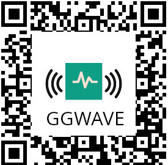

#  GGWave Skill

Voice interface for [ggwave plugin](https://github.com/OpenVoiceOS/ovos-audio-transformer-plugin-ggwave)

Allows you to enable/disable ggwave by voice

> When enabled by voice ggwave will stay on for **15 minutes**, after that you need to enable it again

in a spoken interaction users may refer to this plugin several ways, our intents register ggwave as
- ggwave
- audio code
- audio qr code
- audio data

users can ask for basic on/off commands:
- start ggwave
- allow audio data
- disable audio codes
